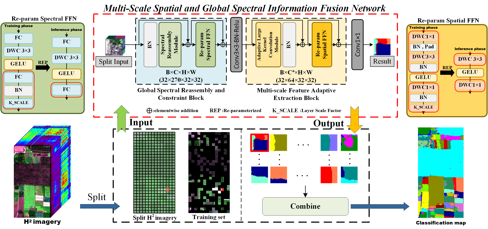

# [MsGsFNet: A Multi-Scale Spatial and Global Spectral Information Fusion Network for UAV-H2 imagery classification](https://ieeexplore.ieee.org/document/11084863)

Wenqing Zhou, Lin Bai, Danni Xue, Yunqi Zhang, Amanda Gozho and Meng Hui
___________

The code in this toolbox implements the MsGsFNet. More specifically, it is detailed as follow.

Citation
---------------------

**Please kindly cite the papers if this code is useful and helpful for your research.**

Wenqing Zhou, Lin Bai, Danni Xue, Yunqi Zhang, Amanda Gozho and Meng Hui. 

MsGsFNet: A Multi-Scale Spatial and Global Spectral Information Fusion Network for UAV-H2 imagery classification, IEEE Transactions on Geoscience and Remote Sensing (TGRS), 2025, DOI: 10.1109/TGRS.2025.3590374.

    @ARTICLE{11084863,
    author={Zhou, Wenqing and Bai, Lin and Xue, Danni and Zhang, Yunqi and Gozho, Amanda and Hui, Meng},
    journal={IEEE Transactions on Geoscience and Remote Sensing}, 
    title={MsGsFNet: A Multi-Scale Spatial and Global Spectral Information Fusion Network for UAV-H2 imagery classification}, 
    year={2025},
    volume={},
    number={},
    pages={1-1},
    keywords={Feature extraction;Vectors;Kernel;Redundancy;Hyperspectral imaging;Training;Spatial resolution;Land surface;Data mining;Transformers;Hyperspectral image (HSI) classification;non-negative matrix factorization;spatial-spectral information fusion;large kernel convolution},
    doi={10.1109/TGRS.2025.3590374}}
    
System-specific notes
---------------------
The codes of networks were tested using PyTorch 1.12.0 version (CUDA 11.6) in Python 3.8.19 on Ubuntu system.

How to use it?
---------------------
📁 Data Preparation

We provide dataset splitting scripts that ensure non-overlapping spatial regions, located in each dataset folder with filenames such as sample_5-30_split.py.

These scripts offer flexible control over how datasets are divided — including options for patch size, training ratio, and more. 

We designed the splitting process to be performed separately from the training phase, so that different models can be trained on a consistent dataset split for fair comparison.

If you prefer to directly use our pre-divided datasets, please follow the instructions below.

Due to the relatively large size of our datasets, we could not include them directly in this repository. You may download them from the following cloud storage link and unzip them locally:

###########################################

Link: https://pan.quark.cn/s/311741ab55ad

Extraction Code: PaY1

###########################################

After downloading, please replace the corresponding empty dataset folders in this repository with the actual data from the downloaded files. For example, replace:

The split datasets/WHU-Hi-HongHu/Image32_step_patch/HSI-rad

→ oold/WHU-Hi-HongHu/Image32_step_patch/HSI-rad

Similarly, replace the corresponding folders under Labels/ as needed.

The datasets used in our paper are clearly named and structured in both this repository and the shared archive:

WHU-Hi-HongHu; WHU-Hi-LongKou; WHU-Hi-HanChuan and QUH-Qingyun.

⚠️ Note: 

Inside each dataset's Image32_step_patch folder, please make sure the following text files are present:

NEW_seed10_25_train_aug.txt (augmented training set)

NEW_seed10_25_train.txt (original training set)

NEW_seed10_25_test.txt (test set)

Here, 25 indicates that the minimum training ratio is 25%.

🧪 Code Usage

The entire codebase is organized under the oold directory, which contains the original implementation of MsGsFNet.

Our network (MsGsFNet) does not alter the spatial dimensions of the image during processing; it only changes the number of channels. 

And it is originally designed for a pixels-to-pixels (patch-free) classification approach. However, we have also implemented a framework that supports the patch-based approach — by simply setting patch_based=True during the initialization of MsGsFNet.

The proposed MsGsFNet architecture is implemented under:

./oold/networks/MsGsFNet.py

and its sub-module VRAttention is located in:

./oold/networks/VRAttention.py

🔹 Training

To begin training, open train.py.

For experiment reproducibility, we fix the random seed at the beginning of the script (dataset-specific seeds are clearly noted).

Next, scroll to line 242 and configure the experiment:

Select the dataset you wish to use;

Fix the path to save the model weight in the line 208 (/oold/pretrainedweights/_bestMiou_);

Confirm the model settings.

Before training, please open VRAttention.py and check line 18 to adjust the value of parameter R according to the dataset being used. As discussed in our paper, R may need to be tuned if you wish to evaluate MsGsFNet as a baseline on other datasets.

🔹 Testing

After training, please run Test the test.py to evaluate the model on the test set. Again, ensure that all model parameters and settings are correctly configured before testing.

👀 Additional Tools

To facilitate further research and discussion, we also provide:

Code for receptive field visualization;

Code for kernel parameter visualization.

We hope these resources will be helpful for your experiments and academic exploration.

If you encounter the bugs while using this code, please do not hesitate to contact us.

Licensing
---------

Copyright (c) 2025 Wenqing Zhou

Permission is hereby granted, free of charge, to any person obtaining a copy
of this software and associated documentation files (the "Software"), to deal
in the Software without restriction, including without limitation the rights
to use, copy, modify, merge, publish, distribute, sublicense, and/or sell
copies of the Software, and to permit persons to whom the Software is
furnished to do so, subject to the following conditions:

The above copyright notice and this permission notice shall be included in all
copies or substantial portions of the Software.

Contact Information:
--------------------

Wenqing Zhou

Chang'an University, Xi’an, China

📧 Email: 1641249599@chd.edu.cn 

